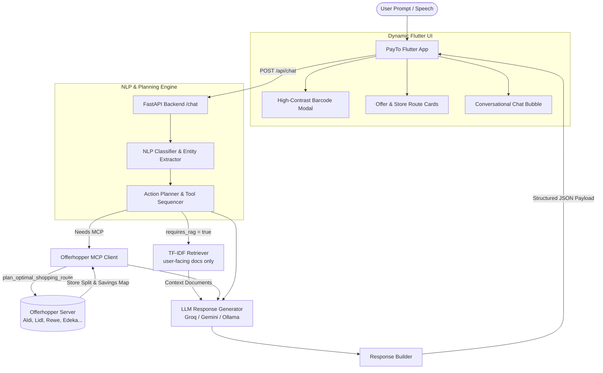

# Noah AI — Intelligent Shopping & PayTo Assistant

<div align="center">


**Noah** is an embedded conversational intelligence and action engine built for the **PayTo** mobile ecosystem. It combines calibrated route classification, deterministic action planning, live shopping route optimization via Offerhopper MCP, document-grounded retrieval, and LLM synthesis to deliver structured in-app interactions.

</div>

---

## 📑 Table of Contents

- [Overview](#-overview)
- [Key Features](#-key-features)
- [System Architecture](#-system-architecture)
- [Directory Structure](#-directory-structure)
- [Installation & Setup](#-installation--setup)
- [Configuration](#-configuration)
- [Model Training & NLP Pipeline](#-model-training--nlp-pipeline)
- [API Reference](#-api-reference)
- [Offerhopper MCP Integration](#-offerhopper-mcp-integration)
- [Flutter App Integration](#-flutter-app-integration)
- [Deployment](#-deployment)
- [Testing & Verification](#-testing--verification)

---

## 🌟 Overview

Noah bridges user intent with actionable PayTo application logic and real-world grocery intelligence. Rather than acting merely as a conversational chatbot, Noah:
1. **Understands Intent**: Predicts a single *route* — `(sub_intent, planner_actions)` — with a calibrated scikit-learn classifier, then derives every other taxonomy field (domain, intent, tool, response mode, workflow, tool sequence) from that route. Below a calibrated confidence floor it asks a clarifying question instead of acting.
2. **Plans In-App Actions**: Translates intents into structured UI actions (e.g., barcode modals, card open triggers, offer carousels).
3. **Optimizes Grocery Basket & Routes**: Connects to the **Offerhopper MCP server** (`https://mcp.offerhopper.ai/mcp`) to split shopping lists across German supermarkets (Aldi, Lidl, Rewe, Edeka, etc.) for maximum savings and minimal travel time.
4. **Retrieves Grounded Knowledge**: Augments LLM answers with TF-IDF retrieval over an allowlist of user-facing documents (privacy policy, published FAQ). When nothing clears the relevance floor Noah says it does not have the answer rather than improvising.
5. **Emits Structured JSON**: Returns machine-readable payloads directly consumable by the Flutter frontend.

---

## 🚀 Key Features

* **Single-Route Intent Classification**: Fast CPU inference using word + character TF-IDF and a calibrated logistic-regression pipeline (`route.joblib`). Character n-grams carry typo and German-compound robustness; deriving the remaining fields from `route_registry.json` makes a self-contradictory response unrepresentable.
* **Abstention**: Requests below the calibrated confidence threshold return zero planner actions and a clarifying question, rather than a guessed action.
* **Bilingual**: English and German input, with replies in the language the user wrote in.
* **Action Planner & Tool Sequencer**: Dynamically generates execution plans (`planner_actions`, `tool_sequence`, `response_mode`).
* **Live Offerhopper MCP Integration**: Fetches real-time store splits, product prices, total savings, and interactive map URLs via JSON-RPC / Streamable HTTP.
* **Document-Grounded RAG**: TF-IDF retrieval over an explicit allowlist of *user-facing* documents (privacy policy, published FAQ) plus a relevance floor. Internal engineering documents are never indexed, so they cannot be quoted back to a user.
* **Pluggable LLM Providers**: Unified interface supporting **Groq** (`llama-3.3-70b-versatile`), **Google Gemini**, and **Ollama**.
* **Flutter-First Response Modes**:
  * `functional`: High-contrast barcode modal triggers with automatic screen brightness boosting.
  * `hybrid`: Product comparison tiles, store-split savings cards, and offer carousels.
  * `navigation`: Integrated directions and store locator intents.
  * `text`: Grounded conversational explanations.

---

## 🏗️ System Architecture



---

## 📂 Directory Structure

```text
Noah/
├── noah_backend/
│   ├── app/
│   │   ├── api/
│   │   │   └── chat.py               # Main POST /api/chat router
│   │   ├── llm/
│   │   │   ├── provider.py           # Abstract LLM provider interface
│   │   │   ├── response_generator.py # Prompt template & context grounding
│   │   │   └── gemini.py             # Gemini implementation
│   │   ├── models/
│   │   │   └── noah_response.py      # Pydantic schemas & response models
│   │   ├── nlp/
│   │   │   ├── classifier.py         # Route prediction, abstention, plan expansion
│   │   │   ├── routing.py            # Shared route scoring (train + serve)
│   │   │   ├── entity_extractor.py   # Pattern & keyword entity extraction
│   │   │   ├── model_loader.py       # Route model + registry loading
│   │   │   └── train.py              # Trainer + leakage-free evaluation
│   │   ├── planner/
│   │   │   ├── action_registry.py    # Available app actions & tool maps
│   │   │   └── planner.py            # Rule & model-based action sequencer
│   │   ├── rag/
│   │   │   └── retriever.py          # TF-IDF retrieval over allowlisted documents
│   │   ├── tools/
│   │   │   └── offerhopper.py        # Offerhopper MCP client (HTTP JSON-RPC)
│   │   └── main.py                   # FastAPI initialization & health checks
│   ├── dataset/                      # Corpora, plus noah_holdout_probes.csv
│   ├── scripts/
│   │   └── build_dataset.py          # Rebuilds noah_dataset_v3.csv from the legacy export
│   ├── rag/                          # Reference PDFs & documents for RAG
│   ├── tests/
│   │   ├── test_api_chat.py          # Pytest API & integration test suite
│   │   └── test_response_contract.py # Frozen /api/chat wire contract
│   ├── trained_models/               # route.joblib, route_registry.json, evaluation.json
│   ├── Dockerfile                    # Containerization specification
│   ├── requirements.txt              # Python dependencies
│   └── verify_live.py                # Live verification & interactive test script
├── noah_flutter_implementation_plan.md # Comprehensive Flutter integration blueprint
├── pyproject.toml
└── README.md
```

---

## ⚡ Installation & Setup

### 1. Clone the Repository
```bash
git clone https://github.com/schlechtswapnanil/Noah.git
cd Noah/noah_backend
```

### 2. Set Up Virtual Environment
```bash
# Using Python 3.10+
python -m venv .venv

# On Linux/macOS:
source .venv/bin/activate

# On Windows (PowerShell):
.venv\Scripts\Activate.ps1
```

### 3. Install Dependencies
```bash
pip install --upgrade pip
pip install -r requirements.txt
```

---

## ⚙️ Configuration

Create a `.env` file inside `noah_backend/` (or set environment variables):

```env
# LLM Provider Configuration
LLM_PROVIDER=groq                     # Options: groq, gemini, ollama
GROQ_API_KEY=your_groq_api_key_here
GEMINI_API_KEY=your_gemini_api_key_here
GROQ_MODEL=llama-3.3-70b-versatile

# Offerhopper MCP Server Endpoint
OFFERHOPPER_MCP_URL=https://mcp.offerhopper.ai/mcp

# Server Settings
HOST=0.0.0.0
PORT=8000
```

---

## 🧠 Model Training & NLP Pipeline

Noah predicts one label — the **route**, `(sub_intent, planner_actions)` — and derives everything else from it. In the corpus that pair determines `domain`, `intent`, `tool`, `response_mode`, the `requires_*` flags and `tool_sequence` with no ambiguity, so a single model replaces the thirteen independent heads that used to disagree with one another.

### Rebuilding the corpus
```bash
cd noah_backend
python -m scripts.build_dataset      # -> dataset/noah_dataset_v3.csv
```
The legacy export (`noah_dataset_20k_final.csv`) is 21,000 rows built from only 4,377 unique utterances, so a random row split placed 86% of the test set into training verbatim and scored 1.00. The builder de-duplicates, resolves conflicting label tuples, repairs the `single`/`single_step` taxonomy overlap, and adds German, out-of-scope negatives, cross-tool multi-intent utterances and typo/ASR noise. Every label value stays inside the legacy vocabulary — the wire contract does not move.

### Training
```bash
python -m app.nlp.train
```
Writes `trained_models/route.joblib` (pipeline + calibrated confidence threshold), `trained_models/route_registry.json` (route → all other fields) and `trained_models/evaluation.json`.

Evaluation splits by **surface template**, not by row, so a paraphrase of a training utterance cannot land in the test set. It also scores `dataset/noah_holdout_probes.csv` — hand-written utterances that never enter the corpus, half used to calibrate the confidence threshold and half held back to report generalisation. The trainer fails if any probe leaks into training.

---

## 📡 API Reference

### Health Check
`GET /health`
```json
{
  "status": "ok"
}
```

### Chat & Action Endpoint
`POST /api/chat`

#### Request Body
```json
{
  "instruction": "Find the cheapest basket for milk, eggs and bread in Hamburg"
}
```

#### Response Body

The key set is frozen and identical for every request — see `noah_backend/tests/test_response_contract.py`.

```json
{
  "instruction": "Find the cheapest basket for milk, eggs and bread in Hamburg",
  "domain": "SHOPPING",
  "intent": "FIND_CHEAPEST_BASKET",
  "sub_intent": "FIND_CHEAPEST_BASKET",
  "tool": "offerhopper_mcp",
  "response_mode": "hybrid",
  "requires_memory": false,
  "requires_rag": false,
  "requires_recommendation": true,
  "workflow_type": "single_step",
  "planner_actions": ["FIND_CHEAPEST_BASKET"],
  "planner_action_count": 1,
  "tool_sequence": ["offerhopper_mcp"],
  "entity_product": "Milk, Eggs, Bread",
  "entity_merchant": null,
  "entity_brand": null,
  "entity_category": null,
  "entity_price_min": null,
  "entity_price_max": null,
  "entity_location": "Hamburg",
  "entity_radius": null,
  "entity_loyalty_card": null,
  "offerhopperData": {
    "success": true,
    "optimized_route": {
      "stores": ["..."],
      "route_segments": [
        {
          "to_name": "Edeka",
          "to_store": { "name": "Edeka" },
          "distance_km": 1.4,
          "duration_minutes": 6,
          "estimated_cost_at_store": 5.09,
          "products_to_buy": [
            { "selected_product": "Frische Milch", "price": 1.11, "regular_price": 1.29, "discount_pct": 14, "quantity": 1 }
          ]
        }
      ],
      "estimated_total_cost": 10.44,
      "estimated_total_savings": 0.48,
      "total_distance_km": 3.2,
      "total_duration_minutes": 14
    },
    "cost_analysis": { "product_cost": 5.09, "travel_cost": 1.86, "in_store_time_cost": 3.0, "verdict": "..." },
    "total_estimated_cost": 10.44,
    "total_estimated_savings": 0.48,
    "share_url": "https://offerhopper.ai/s/OPfn_NeP",
    "ai_description": "..."
  },
  "response": "Found Vollkorn at Edeka for €1.19, Frische Milch at Edeka for €1.11, Herzstücke Eier at Edeka for €2.79. (Estimated savings: €0.48)"
}
```

**Value vocabularies.** `domain` ∈ `ACCOUNT, CHAT, KNOWLEDGE, MERCHANT, NAVIGATION, OFFER, PRODUCT, RECOMMENDATION, SHOPPING, SYSTEM, WALLET`. `response_mode` ∈ `functional, hybrid, navigation, text`. `workflow_type` ∈ `single_step, multi_step, sequential`. `planner_actions` are keys of `app/planner/action_registry.py`, and `tool_sequence[i]` is always the tool that action `i` maps to.

#### When Noah is unsure

Below the calibrated confidence threshold, or for a request outside PayTo's scope, the response keeps the same shape but carries no actions — the client should render `response` as a chat bubble and dispatch nothing:

```json
{
  "instruction": "transfer 50 euros to my brother",
  "domain": "CHAT",
  "intent": "UNKNOWN",
  "sub_intent": "UNKNOWN",
  "tool": "none",
  "response_mode": "text",
  "workflow_type": "single_step",
  "planner_actions": [],
  "planner_action_count": 0,
  "tool_sequence": [],
  "offerhopperData": null,
  "response": "I'm not sure what you need there. I can find products and offers, open your loyalty cards, or plan a cheaper shopping trip - which would you like?"
}
```

If the OfferHopper call fails, `offerhopperData` is `null` and `response` says the price service was unreachable — it never reports prices that were not returned.

---

## 🛒 Offerhopper MCP Integration

Noah implements the **Model Context Protocol (MCP)** specification connecting directly to Offerhopper:

* **Endpoint**: `https://mcp.offerhopper.ai/mcp`
* **Transport**: Streamable HTTP / JSON-RPC 2.0
* **Covered Retailers**: Aldi Süd/Nord, Lidl, Rewe, Edeka, Penny, Netto, DM, Rossmann, Müller.
* **Tool Invocation**: `plan_optimal_shopping_route(items, location)`

---

## 📱 Flutter App Integration

Noah is designed to power the Flutter conversational interface:
1. **`NoahChatProvider`**: Manages state, session history, and network calls.
2. **`NoahActionDispatcher`**: Parses `planner_actions` and `response_mode` to pop up relevant modals:
   * **Loyalty Barcodes**: Instant full-screen barcode presentation.
   * **Route & Split Cards**: Tappable store cards with interactive navigation links.
   * **Offer Carousels**: Horizontal scrollable product deal cards.

> **Client gap to close:** `NoahActionDispatcher` switches on `PLAN_ROUTE` and `OPEN_GOOGLE_MAPS`, but not on `GET_DIRECTIONS`, which is a valid `maps_tool` action in the registry. "Take me to / drive me to / navigate to X" is trained onto `PLAN_ROUTE` so the common phrasings work today, but "How do I get to Rewe?" still returns `GET_DIRECTIONS` and the app will silently do nothing. Add it to the same `case` group.

> Requests with no actions (`planner_actions: []`) are Noah asking a clarifying question or answering conversationally — render `response` and dispatch nothing.

*For complete implementation details and Dart widget architecture, refer to [`noah_flutter_implementation_plan.md`](./noah_flutter_implementation_plan.md).*

---

## 🚀 Deployment

### Hugging Face Spaces (free)

```bash
# 1. Create the Space first: https://huggingface.co/new-space -> SDK: Docker -> Blank
# 2. Get a write token:      https://huggingface.co/settings/tokens
HF_TOKEN=hf_xxx deploy/huggingface/publish.sh <your-hf-username> noah-payto-api
```

`publish.sh` assembles a Space containing only the request path — `app/`, the two
trained-model artifacts, the FAQ cache and `requirements.txt` (~9 MB). Training
corpora, the legacy `.joblib` heads and the test suite are left out. Run it with
`DRY_RUN=1` to inspect the assembled tree without pushing.

The Space serves on port 7860 as uid 1000, per
[`deploy/huggingface/Dockerfile`](./deploy/huggingface/Dockerfile). Once built:

```bash
curl -s https://<username>-noah-payto-api.hf.space/health
```

> The Space is public and CORS is open. If you set `LLM_API_KEY` as a Space
> secret, every public request spends your Groq quota — for an unattended demo,
> leaving it unset is safer. Routing and grounding are identical either way;
> only the phrasing of `response` changes.

### Render

[`render.yaml`](./render.yaml) defines the `noah-backend` service (Docker, Frankfurt)
and deploys automatically on push to `main`. Free web services spin down after
~15 minutes of inactivity, so the first request after a quiet spell is slow.

---

## 🧪 Testing & Verification

### Run Automated Unit & Integration Tests
```bash
cd noah_backend
pytest tests/ -v
```
`tests/test_response_contract.py` pins the `/api/chat` request shape, response key set, value types and label vocabularies. It must stay green across any retraining or refactor — the Flutter client dispatches on `planner_actions`, `entities.*`, `response_mode` and `offerhopperData`.

Note: `tests/test_api_chat.py` calls the live Offerhopper MCP server and will fail with `429 Too Many Requests` if run repeatedly in quick succession.

### Run Live Interactive CLI Verification
```bash
cd noah_backend
python verify_live.py
```

### Run Development Server
```bash
cd noah_backend
uvicorn app.main:app --reload --port 8000
```

---

## 👥 Authors & Acknowledgments

* **Noah AI Team** — Built for PayTo Smart Assistant Ecosystem.
* **Offerhopper.ai** — Supermarket price data and routing MCP server.
