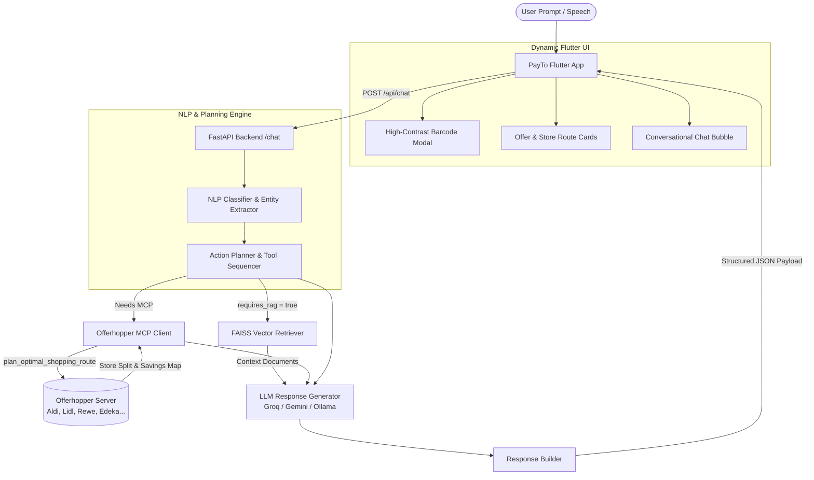

# Noah AI — Intelligent Shopping & PayTo Assistant

<div align="center">


**Noah** is an embedded conversational intelligence and action engine built for the **PayTo** mobile ecosystem. It combines multi-task NLP classification, deterministic action planning, live shopping route optimization via Offerhopper MCP, FAISS-powered document RAG, and LLM synthesis to deliver structured in-app interactions.

</div>

---

## 📑 Table of Contents

- [Overview](#-overview)
- [Key Features](#-key-features)
- [System Architecture](#-system-architecture)
- [Directory Structure](#-directory-structure)
- [Installation & Setup](#-installation--setup)
- [Configuration](#-configuration)
- [Model Training & NLP Pipeline](#-model-training--nlp-pipeline)
- [API Reference](#-api-reference)
- [Offerhopper MCP Integration](#-offerhopper-mcp-integration)
- [Flutter App Integration](#-flutter-app-integration)
- [Testing & Verification](#-testing--verification)

---

## 🌟 Overview

Noah bridges user intent with actionable PayTo application logic and real-world grocery intelligence. Rather than acting merely as a conversational chatbot, Noah:
1. **Understands Intent**: Evaluates multi-target taxonomy parameters (domain, intent, sub-intent, entities, workflow, tool requirements) using scikit-learn models trained on 20,000+ domain utterances.
2. **Plans In-App Actions**: Translates intents into structured UI actions (e.g., barcode modals, card open triggers, offer carousels).
3. **Optimizes Grocery Basket & Routes**: Connects to the **Offerhopper MCP server** (`https://mcp.offerhopper.ai/mcp`) to split shopping lists across German supermarkets (Aldi, Lidl, Rewe, Edeka, etc.) for maximum savings and minimal travel time.
4. **Retrieves Grounded Knowledge**: Augments LLM answers with FAISS-based vector search over PayTo policies, guides, and subscription manuals.
5. **Emits Structured JSON**: Returns machine-readable payloads directly consumable by the Flutter frontend.

---

## 🚀 Key Features

* **Multi-Target Intent & Entity Classification**: Fast CPU-level inference using TF-IDF vectorizers and calibrated classifiers (`joblib` pipelines).
* **Action Planner & Tool Sequencer**: Dynamically generates execution plans (`planner_actions`, `tool_sequence`, `response_mode`).
* **Live Offerhopper MCP Integration**: Fetches real-time store splits, product prices, total savings, and interactive map URLs via JSON-RPC / Streamable HTTP.
* **Document-Grounded RAG**: Semantic vector retrieval over internal PDFs (`sentence-transformers/all-MiniLM-L6-v2` + `faiss-cpu`) to eliminate hallucinations.
* **Pluggable LLM Providers**: Unified interface supporting **Groq** (`llama-3.3-70b-versatile`), **Google Gemini**, and **Ollama**.
* **Flutter-First Response Modes**:
  * `functional`: High-contrast barcode modal triggers with automatic screen brightness boosting.
  * `hybrid`: Product comparison tiles, store-split savings cards, and offer carousels.
  * `navigation`: Integrated directions and store locator intents.
  * `text`: Grounded conversational explanations.

---

## 🏗️ System Architecture



---

## 📂 Directory Structure

```text
Noah/
├── noah_backend/
│   ├── app/
│   │   ├── api/
│   │   │   └── chat.py               # Main POST /api/chat router
│   │   ├── llm/
│   │   │   ├── provider.py           # Abstract LLM provider interface
│   │   │   ├── response_generator.py # Prompt template & context grounding
│   │   │   └── gemini.py             # Gemini implementation
│   │   ├── models/
│   │   │   └── noah_response.py      # Pydantic schemas & response models
│   │   ├── nlp/
│   │   │   ├── classifier.py         # Multi-target ML inference pipeline
│   │   │   ├── entity_extractor.py   # Pattern & keyword entity extraction
│   │   │   ├── model_loader.py       # Joblib model caching
│   │   │   └── train.py              # Training script for 20k dataset
│   │   ├── planner/
│   │   │   ├── action_registry.py    # Available app actions & tool maps
│   │   │   └── planner.py            # Rule & model-based action sequencer
│   │   ├── rag/
│   │   │   └── retriever.py          # SentenceTransformers + FAISS retrieval
│   │   ├── tools/
│   │   │   └── offerhopper.py        # Offerhopper MCP client (HTTP JSON-RPC)
│   │   └── main.py                   # FastAPI initialization & health checks
│   ├── dataset/                      # Training datasets & taxonomies (CSV)
│   ├── rag/                          # Reference PDFs & documents for RAG
│   ├── tests/
│   │   └── test_api_chat.py          # Pytest API & integration test suite
│   ├── trained_models/               # Serialized .joblib classification models
│   ├── Dockerfile                    # Containerization specification
│   ├── requirements.txt              # Python dependencies
│   └── verify_live.py                # Live verification & interactive test script
├── noah_flutter_implementation_plan.md # Comprehensive Flutter integration blueprint
├── pyproject.toml
└── README.md
```

---

## ⚡ Installation & Setup

### 1. Clone the Repository
```bash
git clone https://github.com/schlechtswapnanil/Noah.git
cd Noah/noah_backend
```

### 2. Set Up Virtual Environment
```bash
# Using Python 3.10+
python -m venv .venv

# On Linux/macOS:
source .venv/bin/activate

# On Windows (PowerShell):
.venv\Scripts\Activate.ps1
```

### 3. Install Dependencies
```bash
pip install --upgrade pip
pip install -r requirements.txt
```

---

## ⚙️ Configuration

Create a `.env` file inside `noah_backend/` (or set environment variables):

```env
# LLM Provider Configuration
LLM_PROVIDER=groq                     # Options: groq, gemini, ollama
GROQ_API_KEY=your_groq_api_key_here
GEMINI_API_KEY=your_gemini_api_key_here
GROQ_MODEL=llama-3.3-70b-versatile

# Offerhopper MCP Server Endpoint
OFFERHOPPER_MCP_URL=https://mcp.offerhopper.ai/mcp

# Server Settings
HOST=0.0.0.0
PORT=8000
```

---

## 🧠 Model Training & NLP Pipeline

Noah uses lightweight, low-latency scikit-learn models for real-time classification on CPU:

* **Intent & Sub-Intent Classification**
* **Domain & Workflow Type Detection**
* **Tool & Recommendation Requirements**
* **Response Mode Determination**

To re-train all models using the dataset:
```bash
cd noah_backend
python -m app.nlp.train
```
Trained artifacts will be saved as `.joblib` files under `noah_backend/trained_models/` along with performance evaluation metrics in `evaluation.json`.

---

## 📡 API Reference

### Health Check
`GET /health`
```json
{
  "status": "ok"
}
```

### Chat & Action Endpoint
`POST /api/chat`

#### Request Body
```json
{
  "instruction": "Find the cheapest basket for milk, eggs and bread in Hamburg"
}
```

#### Response Body
```json
{
  "instruction": "Find the cheapest basket for milk, eggs and bread in Hamburg",
  "domain": "shopping",
  "intent": "offerhopper_optimization",
  "sub_intent": "find_cheapest_basket",
  "response_mode": "hybrid",
  "workflow_type": "external_mcp",
  "requires_rag": false,
  "requires_recommendation": true,
  "requires_memory": false,
  "entity_product": "milk, eggs, bread",
  "entity_location": "Hamburg",
  "planner_actions": [
    "CALL_OFFERHOPPER_MCP",
    "DISPLAY_STORE_SPLIT_CARD"
  ],
  "planner_action_count": 2,
  "tool_sequence": [
    "offerhopper_mcp"
  ],
  "offerhopperData": {
    "summary": "Save €4.20 across 2 stores (Lidl & Rewe)",
    "stores": [
      {
        "store": "Lidl",
        "items": ["Milk 1L (€0.99)", "Eggs 10pk (€1.69)"],
        "subtotal": "€2.68"
      },
      {
        "store": "Rewe",
        "items": ["Toast Bread 500g (€1.19)"],
        "subtotal": "€1.19"
      }
    ],
    "total": "€3.87",
    "total_savings": "€4.20",
    "share_url": "https://offerhopper.ai/route/share/abc123xyz"
  },
  "response": "I've optimized your shopping list for Hamburg. Splitting between Lidl and Rewe saves you €4.20. You can review the split route card above."
}
```

---

## 🛒 Offerhopper MCP Integration

Noah implements the **Model Context Protocol (MCP)** specification connecting directly to Offerhopper:

* **Endpoint**: `https://mcp.offerhopper.ai/mcp`
* **Transport**: Streamable HTTP / JSON-RPC 2.0
* **Covered Retailers**: Aldi Süd/Nord, Lidl, Rewe, Edeka, Penny, Netto, DM, Rossmann, Müller.
* **Tool Invocation**: `plan_optimal_shopping_route(items, location)`

---

## 📱 Flutter App Integration

Noah is designed to power the Flutter conversational interface:
1. **`NoahChatProvider`**: Manages state, session history, and network calls.
2. **`NoahActionDispatcher`**: Parses `planner_actions` and `response_mode` to pop up relevant modals:
   * **Loyalty Barcodes**: Instant full-screen barcode presentation.
   * **Route & Split Cards**: Tappable store cards with interactive navigation links.
   * **Offer Carousels**: Horizontal scrollable product deal cards.

*For complete implementation details and Dart widget architecture, refer to [`noah_flutter_implementation_plan.md`](./noah_flutter_implementation_plan.md).*

---

## 🧪 Testing & Verification

### Run Automated Unit & Integration Tests
```bash
cd noah_backend
pytest tests/ -v
```

### Run Live Interactive CLI Verification
```bash
cd noah_backend
python verify_live.py
```

### Run Development Server
```bash
cd noah_backend
uvicorn app.main:app --reload --port 8000
```

---

## 👥 Authors & Acknowledgments

* **Noah AI Team** — Built for PayTo Smart Assistant Ecosystem.
* **Offerhopper.ai** — Supermarket price data and routing MCP server.
